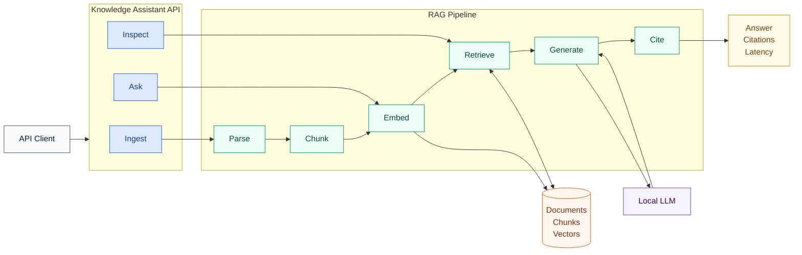
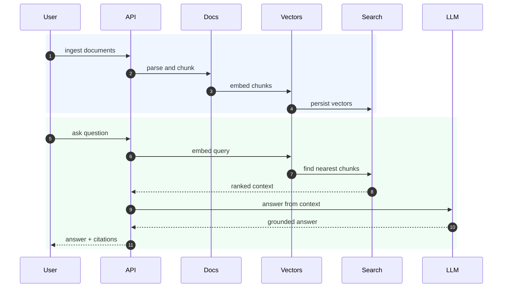
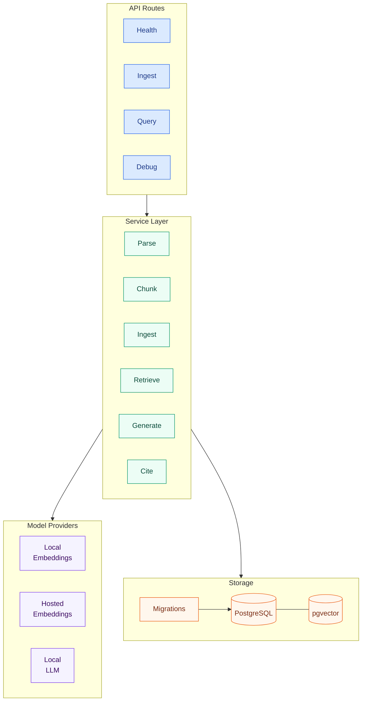

# Knowledge Assistant

Knowledge Assistant is an open source Retrieval-Augmented Generation (RAG) service for turning internal documentation into a queryable knowledge base.

It provides a FastAPI backend for ingesting Markdown and text documents, embedding them into PostgreSQL with pgvector, retrieving relevant context with vector search, and generating grounded answers with citations through a local LLM endpoint.

## Overview

Knowledge Assistant is designed for teams that want a transparent, self-hostable RAG application they can run locally, inspect, and extend. The current implementation focuses on the core backend workflow:

- document ingestion
- parsing and normalization
- chunking with overlap
- local or hosted embeddings
- pgvector-based retrieval
- grounded answer generation
- source citations
- latency and debug metadata

The repository includes sample engineering documents so the full ingestion and query flow can be tried immediately.

## Architecture



## RAG Pipeline



## System Components



## Features

- Ingest `.md` and `.txt` files from a local directory.
- Extract titles from Markdown headings or filenames.
- Normalize text and create fixed-size overlapping chunks.
- Generate local embeddings with SentenceTransformers.
- Optionally use a hosted OpenAI-compatible embeddings endpoint.
- Store document metadata, chunk metadata, and vectors in PostgreSQL.
- Retrieve relevant chunks using pgvector cosine distance.
- Generate grounded answers using only retrieved context.
- Return citations for the chunks used as evidence.
- Include request IDs, fallback flags, latency breakdowns, and optional debug payloads.
- Manage schema changes with Alembic migrations.

## Tech Stack

- Python
- FastAPI
- Pydantic
- SQLAlchemy
- Alembic
- PostgreSQL
- pgvector
- SentenceTransformers
- Ollama-compatible chat API
- Docker and Docker Compose

## Project Structure

```text
app/
  api/                     HTTP routes
  core/                    configuration and logging
  db/                      SQLAlchemy session and models
  domain/                  Pydantic request/response schemas
  providers/
    embeddings/            local and hosted embedding providers
    llm/                   local LLM provider
  services/                ingestion, retrieval, generation, citations
  utils/                   file helpers
data/raw/                  sample documents
migrations/                Alembic migrations
scripts/                   utility scripts
```

## Sample Knowledge Base

The repository includes sample internal engineering documents in `data/raw`:

- architecture overview
- authentication API specification
- database failover incident postmortem
- engineering onboarding notes
- on-call playbook
- deploy and rollback runbook

These documents are included so the ingestion, retrieval, and answer-generation workflow can be tested without preparing a separate dataset.

## Quickstart

Copy the environment template:

```bash
cp .env.template .env
```

Set the database values in `.env`:

```env
DATABASE_USER=postgres
DATABASE_PASSWORD=postgres
DATABASE_NAME=ragdb
DATABASE_URL=postgresql+psycopg2://postgres:postgres@db:5432/ragdb
```

Start the application and database:

```bash
docker-compose up --build
```

Apply database migrations:

```bash
docker exec -it rag_api alembic upgrade head
```

The API is available at:

```text
http://localhost:8000
```

## Local LLM

The query endpoint uses an Ollama-compatible local chat endpoint by default.

Example Ollama setup:

```bash
ollama pull qwen3:14b
ollama serve
```

Default LLM configuration:

```env
LLM_PROVIDER=local
LLM_MODEL=qwen3:14b
LLM_API_URL=http://host.docker.internal:11434/api/chat
```

If you use another local model, update `LLM_MODEL` in `.env`.

## Embeddings

The default embedding provider runs locally with SentenceTransformers:

```env
EMBEDDING_PROVIDER=local
EMBEDDING_MODEL=BAAI/bge-base-en-v1.5
EMBEDDING_DIM=768
```

`BAAI/bge-base-en-v1.5` produces 768-dimensional vectors. If you change the embedding model, `EMBEDDING_DIM` and the `chunks.embedding` pgvector column dimension must match.

The hosted embedding provider assumes an OpenAI-compatible embeddings endpoint:

```env
EMBEDDING_PROVIDER=hosted
EMBEDDING_API_KEY=...
EMBEDDING_API_URL=...
```

## API Usage

### Health Check

```bash
curl http://localhost:8000/health
```

Example response:

```json
{
  "status": "ok",
  "app_name": "Knowledge Assistant",
  "db_status": "ok"
}
```

### Ingest Documents

```bash
curl -X POST http://localhost:8000/v1/documents/ingest \
  -H "Content-Type: application/json" \
  -d '{
    "source_dir": "data/raw",
    "recursive": true,
    "file_types": ["md", "txt"],
    "chunking_strategy": "fixed"
  }'
```

Example response:

```json
{
  "documents_ingested": 6,
  "chunks_created": 14,
  "skipped_documents": 0,
  "status": "success"
}
```

Documents are deduplicated by `source_path`. Re-ingesting the same directory skips files that already exist in the database.

### Query the Knowledge Base

```bash
curl -X POST http://localhost:8000/v1/query \
  -H "Content-Type: application/json" \
  -d '{
    "query": "How do we roll back a failed deployment?",
    "top_k": 5,
    "max_context_chunks": 4,
    "include_debug": true
  }'
```

Response shape:

```json
{
  "answer": "...",
  "citations": [
    {
      "document_title": "Runbook Deploy Rollback",
      "chunk_index": 0,
      "section_heading": null
    }
  ],
  "request_id": "...",
  "fallback_triggered": false,
  "latency_ms": {
    "retrieval": 12.34,
    "generation": 1234.56,
    "total": 1246.9
  },
  "debug": {
    "retrieved_chunks": [],
    "context_chunk_count": 4
  }
}
```

### Inspect Retrieval Results

Use the retrieval debug endpoint to inspect vector-search matches without invoking the LLM:

```bash
curl -X POST http://localhost:8000/v1/retrieval/debug \
  -H "Content-Type: application/json" \
  -d '{
    "query": "database failover incident",
    "top_k": 5
  }'
```

## Configuration Reference

| Variable | Purpose |
| --- | --- |
| `APP_PORT` | API port exposed by Docker Compose |
| `DATABASE_URL` | SQLAlchemy PostgreSQL connection string |
| `DEFAULT_TOP_K` | Number of chunks retrieved before context selection |
| `DEFAULT_MAX_CONTEXT_CHUNKS` | Maximum retrieved chunks sent to the LLM |
| `DEFAULT_CHUNK_SIZE` | Character length for fixed-size chunks |
| `DEFAULT_CHUNK_OVERLAP` | Character overlap between adjacent chunks |
| `EMBEDDING_PROVIDER` | `local` or `hosted` |
| `EMBEDDING_MODEL` | SentenceTransformers model or hosted model ID |
| `EMBEDDING_DIM` | Vector dimension stored in pgvector |
| `EMBEDDING_API_KEY` | API key for hosted embeddings |
| `EMBEDDING_API_URL` | Hosted embeddings endpoint |
| `LLM_PROVIDER` | LLM provider type |
| `LLM_MODEL` | Local model name sent to the chat endpoint |
| `LLM_API_URL` | Ollama-compatible chat endpoint |

## Database and Migrations

The database schema is managed with Alembic.

Apply migrations:

```bash
docker exec -it rag_api alembic upgrade head
```

Create a migration after model changes:

```bash
docker exec -it rag_api alembic revision --autogenerate -m "describe change"
```

Changing vector dimensions on a populated table can fail because pgvector cannot automatically cast between dimensions. When switching embedding models, clear and re-ingest chunks or create a dedicated migration path.

## Design Principles

- Keep the RAG pipeline explicit and inspectable.
- Prefer clear service boundaries over tightly coupled orchestration.
- Keep provider integrations replaceable.
- Store citations and retrieval metadata alongside generated answers.
- Use database migrations for reproducible schema changes.
- Make local development possible with Docker Compose and sample data.

## Roadmap

- Heading-aware or semantic chunking.
- Reranking support for retrieved chunks.
- Query rewriting and multi-query retrieval.
- Response caching.
- Automated retrieval and generation evaluation.
- Document update and re-indexing workflows.
- Authentication and workspace-level isolation.
- Tracing, metrics, and production observability.
